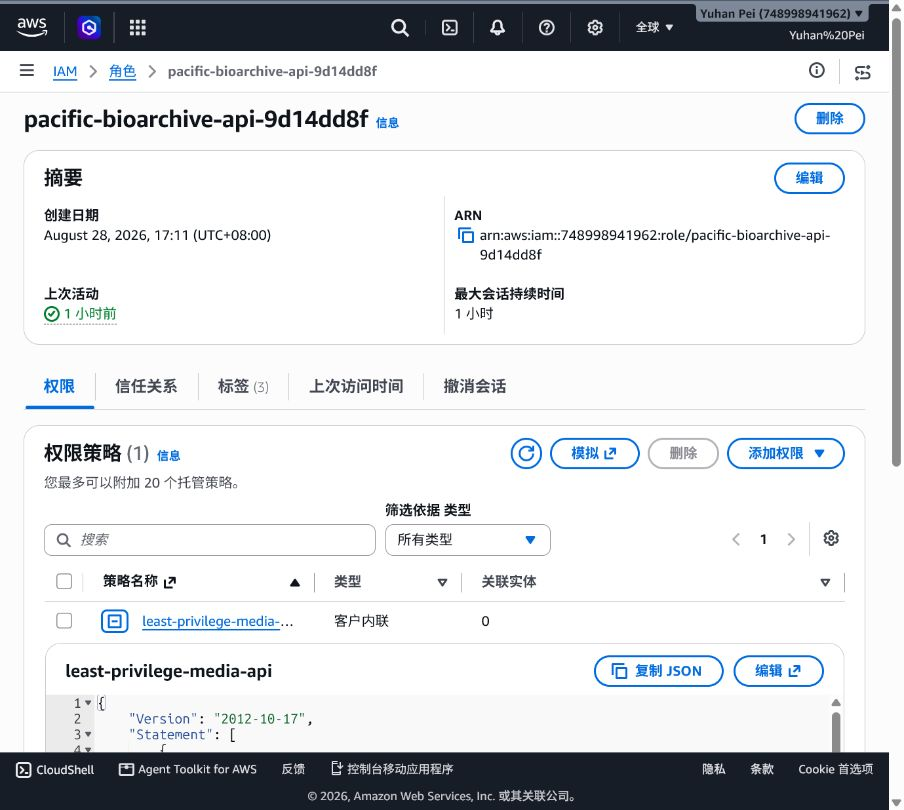
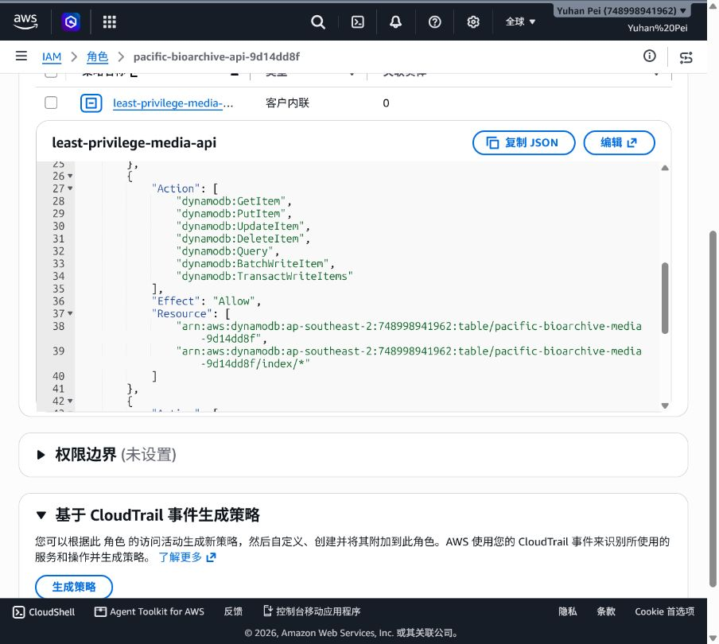
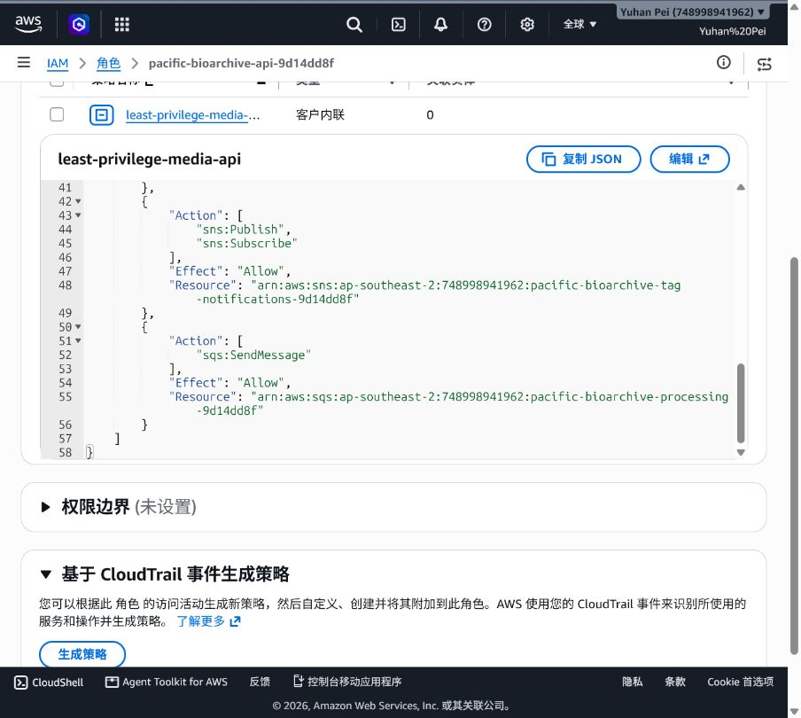
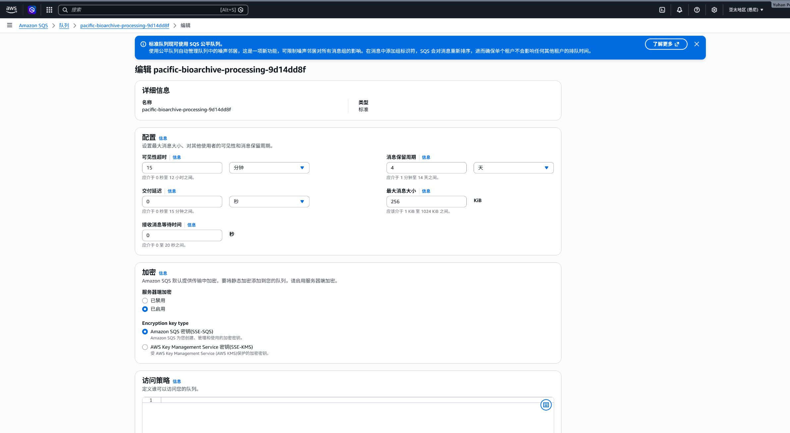
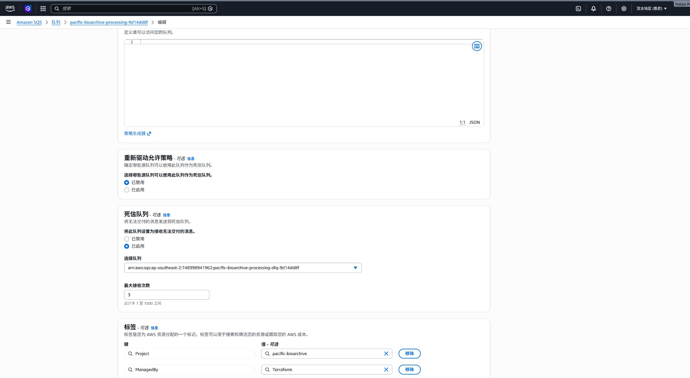
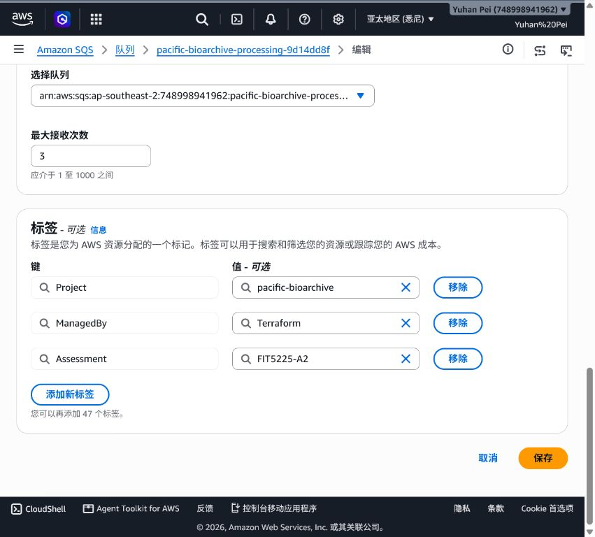
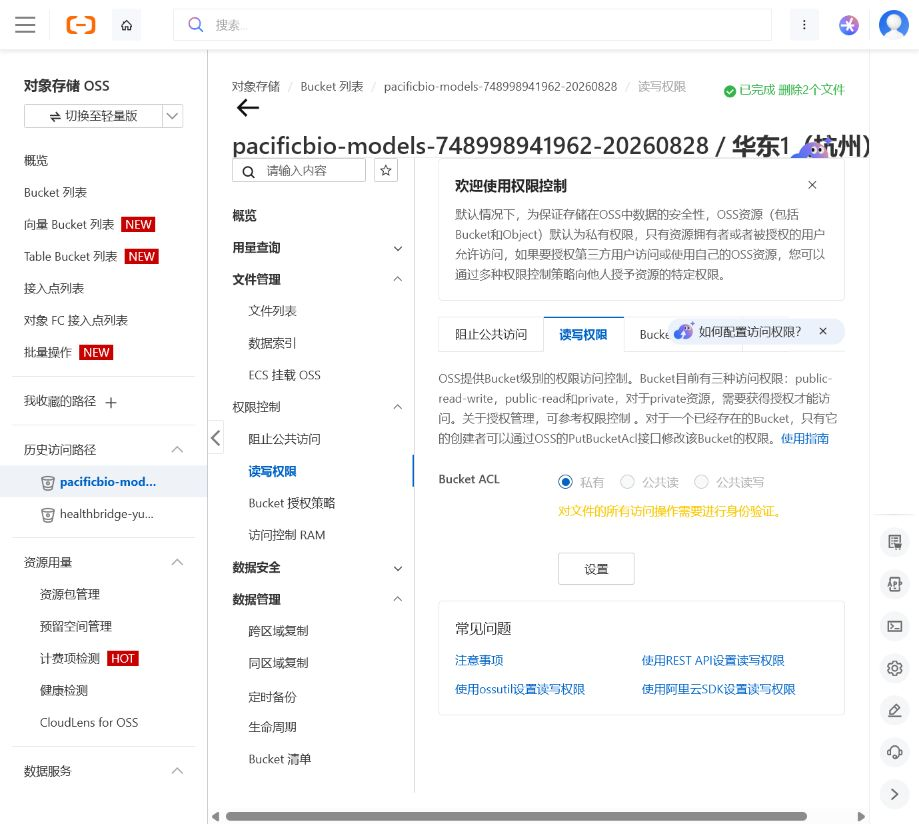

# Pacific BioArchive: Team Report

**Unit:** FIT5225 Assignment 2  
**Team:** Group 13
**Repository:** [03xf/FIT5225-Assessment-2](https://github.com/03xf/FIT5225-Assessment-2) (private repository; teaching staff must be invited before submission)

## 1. System overview and design choices

Pacific BioArchive is an authenticated, multi-cloud wildlife-media archive. AWS hosts Cognito, API Gateway, Lambda, S3, DynamoDB, SQS and SNS; Alibaba Cloud hosts the private Function Compute worker and OSS model artifacts. SQS keeps uploads asynchronous, while query-by-file uses a 300-second timeout for worker cold starts. Private buckets and short-lived signed URLs limit exposure.

## 2. Multi-cloud architecture

Figure 1 shows the deployed AWS/Alibaba Cloud boundary and request flow, with service labels and trust boundaries readable for marking.


*Figure 1. Multi-cloud architecture showing the AWS and Alibaba Cloud service boundary and signed processing flow.*

```text
Browser -> Cognito Hosted UI -> API Gateway (JWT) -> API Lambda
                         |             |-- DynamoDB owner metadata/tag index
                         |             |-- private S3 raw + thumbnail objects
                         |             `-- SQS -> dispatcher Lambda
                         |                           -> signed request -> Alibaba FC worker
                         |                                                  |-> private OSS models
                         |                                                  `-> HMAC callback -> API Lambda -> DynamoDB/SNS
```

The browser calculates SHA-256 and receives no long-lived credentials or worker URL. API Gateway rejects unauthenticated `/api/*` requests. Lambda roles are prefix/service scoped; the worker uses a dispatcher-only key and HMAC callbacks. See [ARCHITECTURE.md](ARCHITECTURE.md) for the trust boundary.

## 3. Functional implementation and testing guide

1. Open the UI, verify Cognito, demonstrate sign-in/sign-out, and show anonymous `/api/media` rejection (401).
2. Upload `Bos_taurus_1.JPG`: SHA-256-bound presigned PUT, owner item in DynamoDB, and duplicate suppression.
3. Upload `video.mp4`: frame sampling, thumbnail, model-hash checks and tags; the record reaches `READY`. Logs: [function-compute-sls-20260830.md](evidence/function-compute-sls-20260830.md).
4. Run species and AND queries; resolve a thumbnail as two users to show owner isolation.
5. Use query-by-file and verify TTL cleanup without creating an archive item.
6. Demonstrate bulk tag add/remove and deletion; verify S3 and DynamoDB before/after, then restore the test image.
7. Subscribe to `felis_catus`, confirm the SNS email, and upload matching media. See [evidence/README.md](evidence/README.md).

## 4. Evidence and limitations

AWS is in `ap-southeast-2`; Alibaba Cloud is in `cn-hangzhou`; the worker is `pacificbio-worker`. The regression suite passes **16 tests**. Evidence covers authentication, 401 rejection, deduplication, video readiness, queries, ownership, cleanup, bulk tags, deletion/restoration, SNS, storage/database state and SLS logs. The image scan still reports upstream base-layer vulnerabilities (`CRITICAL=4` plus `HIGH` findings); rebuild on remediated bases or document a justified risk decision. The SQS DLQ has three historical failed messages. No accuracy percentage is claimed because a 30-image evaluation is outstanding.

### Selected rubric evidence

The following screenshots are embedded for quick marking; the complete evidence bundle is in [evidence/README.md](evidence/README.md).


*Figure 2. Authenticated Cognito session with the owner archive loaded.*

*Figure 3. Signed-out state showing the UI without an authenticated session.*

*Figure 4. Anonymous request to `/api/media` rejected with HTTP 401.*

*Figure 5. Video record in READY state with generated species tags.*

*Figure 6. Alibaba Function Compute invocation logs recorded in SLS.*

*Figure 7. AND tag query returning records matching every condition.*

*Figure 8. Two media records selected with the bulk tag controls ready.*

*Figure 9. Temporary tag added to both selected records (“Tags added”).*

*Figure 10. Temporary tag removed from both records (“Tags removed”).*

*Figure 11. Removing a non-existent tag left records unchanged.*

*Figure 12. Application confirmation after deleting the selected test record.*

*Figure 13. DynamoDB item absent after deletion.*

*Figure 14. Actual AWS SNS email received after the watched `felis_catus` tag was added; the payload records `event: "tag-added"`.*

*Figure 15. AWS API Lambda role with the inline `least-privilege-media-api` policy; the role identity and policy attachment are fully visible.*

*Figure 15a. IAM policy JSON showing the scoped DynamoDB actions and table/index ARNs.*

*Figure 15b. IAM policy JSON showing SNS publish/subscribe and SQS SendMessage permissions, including the scoped resource ARNs.*

*Figure 16. AWS processing queue details showing the queue name, standard queue type, and enabled SSE-SQS encryption.*

*Figure 16a. The same processing queue configured with an enabled dead-letter queue, the DLQ ARN, and maximum receive count of 3.*

*Figure 17. Source queue redrive configuration: 15-minute visibility timeout, DLQ target and maximum receive count of 3.*

*Figure 18. Alibaba OSS model bucket `pacificbio-models-748998941962-20260828` with Bucket ACL set to Private; all object access requires authentication.*

*Figure 19. Authenticated thumbnail resolution and query-by-file panel; no archive item is added.*

*Figure 20. Single-species search for `alectura_lathami` returning matching ready records.*

*Figure 21. Processed `video.mp4` in READY state with model version and aggregate species/count tags.*

*Figure 22. S3 console before deletion showing the test source object.*

*Figure 23. S3 console after deletion showing the test source prefix empty.*

*Figure 24. Production archive banner showing checksum validation; duplicate and SHA-256 details are in the upload evidence record.*

## 5. Team contributions

| Name and student ID | Contribution % | Delivered work |
|---|---:|---|
| **Yuhan Pei (36667528)** | **25%** | **Member 01: API, Cognito/JWT authentication and DynamoDB persistence.** |
| **Mingyu Xu (36667277)** | **25%** | **Member 02: frontend, upload/checksum, search, tags and deletion workflows.** |
| **Zhihao Qian (36667625)** | **25%** | **Member 03: Function Compute worker, model validation, classification and video processing.** |
| **Zhicong Wang (36667676)** | **25%** | **Member 04: Terraform infrastructure, IAM/RAM, SQS/DLQ, deployment and security evidence.** |

The four contribution percentages total 100%; verify repository history before submission.

## 6. Generative AI declaration

GPT was used only to brainstorm design options and to help debug implementation errors. Team members reviewed every suggestion, tested the resulting system, and can explain, modify and defend the submitted code and architecture.
